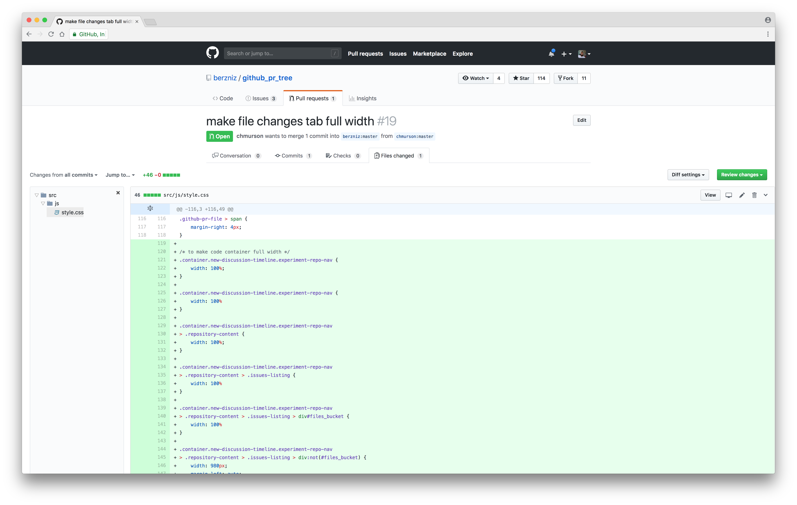

# GitHub Pull Request Tree
Add a file tree to GitHub's Pull Request page



## Install

Install from the Chrome web store: [GitHub Pull Request Tree](https://chrome.google.com/webstore/detail/nfhdjopbhlggibjlimhdbogflgmbiahc)

## Development

1. Install:
    ```bash
    $ yarn install
    ```

2. Run
    ```bash
    $ yarn start
    ```

3. Make changes

4. Click "Reload" on Chrome's "Manage Extensions" tab

## History

Find the change log here: [Changelog](https://github.com/berzniz/github_pr_tree/releases)

## Who made this?

Tal Bereznitskey. Find me on Twitter as [@ketacode](https://twitter.com/ketacode).

This is an open-source community project and is not endorsed or affiliated with GitHub.

